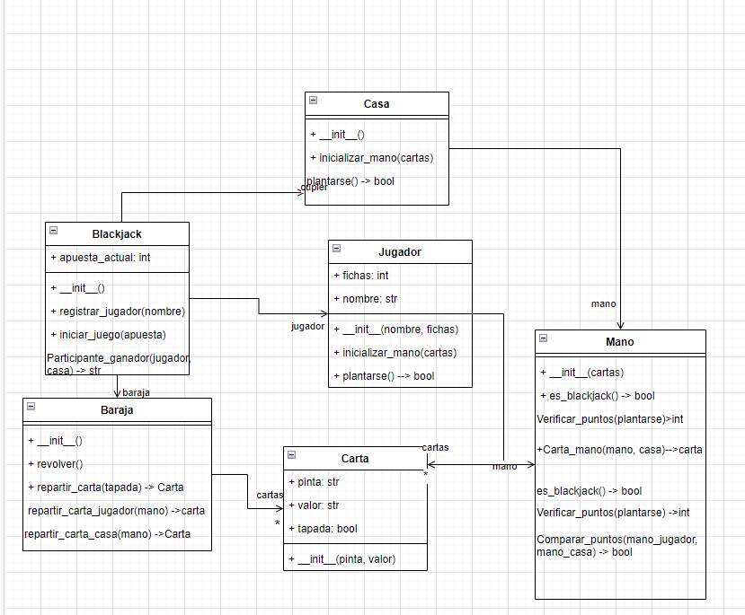

Ejercicio de participacion N6
crear y agregar al diagrama los metodos restantes del ejercicio
blackjack iniciado en clases.

Documento word con los cuadros de cada paso y sus metodos:
https://docs.google.com/document/d/1qHIHAPgZU85nVGdD2p6cPQsp_b6X_LjN/edit?usp=sharing&ouid=113224169074245964224&rtpof=true&sd=true

imagen del diagrama propuesto con los metodos diseñados:
